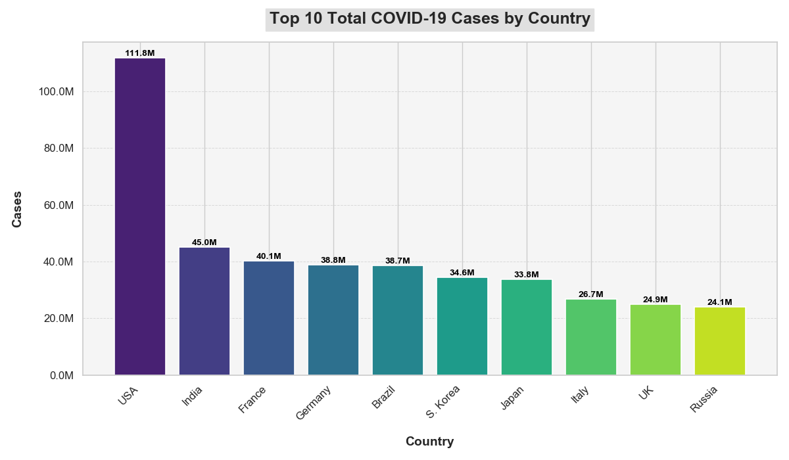
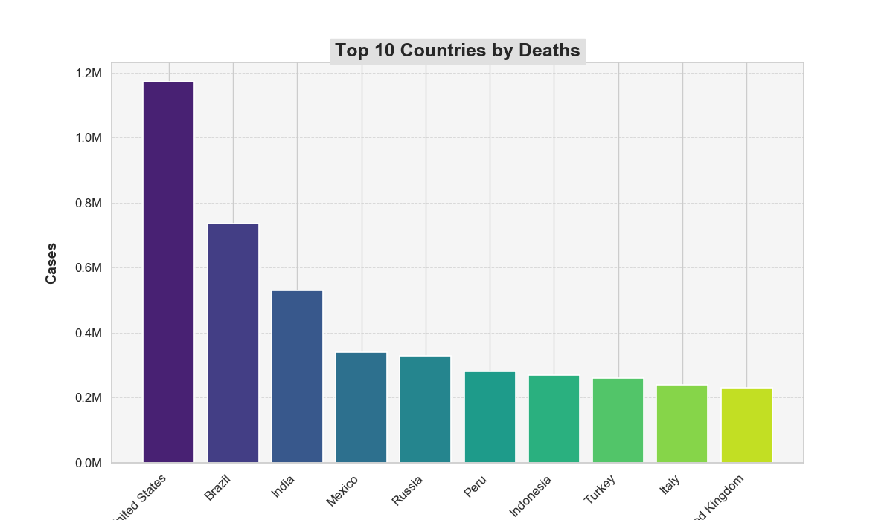

# COVID-19 Case Analysis

## Overview

This repository contains a Python script that generates a bar chart visualizing the total number of COVID-19 cases reported by the top 10 countries with the highest case counts. The chart helps in understanding the global impact of the pandemic and provides a clear comparison of case counts across different countries.

## Chart

## Chart Description

### Title:
**"Global Impact of COVID-19: Top 10 Countries with the Highest Total Case Counts"**

### Data:
The chart represents the total number of COVID-19 cases for the following countries:

- **United States**: 111,820,082 cases
- **India**: 45,035,393 cases
- **France**: 40,138,560 cases
- **Germany**: 38,828,995 cases
- **Brazil**: 38,743,918 cases
- **South Korea**: 34,571,873 cases
- **Japan**: 33,803,572 cases
- **Italy**: 26,723,249 cases
- **United Kingdom**: 24,910,387 cases
- **Russia**: 24,124,215 cases

### Analysis:

- **United States**: The U.S. leads significantly with around 111.8 million cases, reflecting a high impact of the pandemic.
- **India**: With approximately 45 million cases, India is the second most affected country, highlighting the severe pandemic impact in a densely populated region.
- **European Impact**: France and Germany have high case counts, emphasizing the substantial burden in Western Europe.
- **Brazil**: Brazil’s 38.7 million cases show a similar impact to Germany and France, indicating severe effects in South America.
- **Other Countries**: South Korea, Japan, Italy, the UK, and Russia each report significant case numbers, underlining the global reach of COVID-19.
--
# COVID-19 Deaths Analysis

This document analyzes the COVID-19 death statistics for the top 10 countries with the highest reported fatalities. The analysis aims to provide insights into the pandemic's global impact.
## Chart : 

## Analysis

1. **Total Deaths and Distribution**
   - The **United States** has the highest number of COVID-19 deaths, reflecting a severe impact. This is a significant indicator of the pandemic's toll in this region.
   - **Brazil**, **India**, and **Mexico** follow with considerable death tolls, highlighting the severe challenges faced by these large and densely populated countries.

2. **Healthcare and Population Factors**
   - Countries with high death counts often experience challenges related to healthcare infrastructure and population density. For example, **India** and **Brazil** have faced considerable healthcare challenges which likely contribute to their high number of deaths.

3. **Socioeconomic and Geopolitical Influences**
   - The disparity in death counts can be influenced by socioeconomic conditions and the effectiveness of public health systems. For instance, **Mexico** and **Peru** have higher death rates, partly due to economic and healthcare system strains.

4. **Timing and Response**
   - The timing of the pandemic's peak can affect death counts significantly. Early surges in the **United States** and later peaks in countries like **Turkey** demonstrate how the timing of outbreaks influences overall statistics.

5. **Public Health Measures**
   - Variations in public health responses, including the rollout of vaccinations and adherence to health guidelines, contribute to differences in death rates. Countries with slower vaccination efforts or less stringent public health measures tend to have higher fatality numbers.

6. **Per Capita Analysis**
   - Analyzing deaths on a per capita basis provides additional context. For instance, **Peru** has a notably high death rate relative to its population, indicating a severe impact on a per-person basis compared to other countries.

7. **Future Trends**
   - Monitoring these statistics over time can offer insights into the progression of the pandemic and the effectiveness of different interventions. Tracking changes in death counts can help in understanding ongoing challenges and the success of public health responses.

## Conclusion

The top 10 countries by COVID-19 deaths illustrate the diverse impact of the pandemic across different regions. Factors such as healthcare infrastructure, socioeconomic conditions, and the effectiveness of public health measures play critical roles in shaping these statistics. 

For the latest statistics and more detailed

