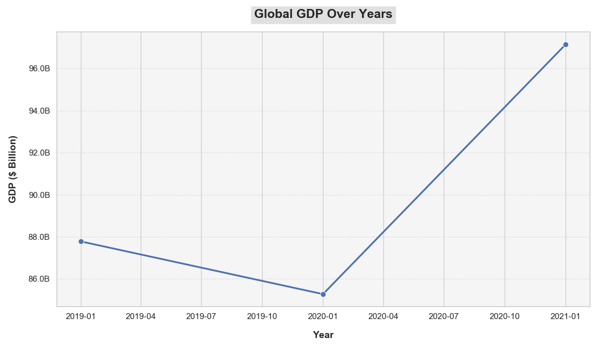
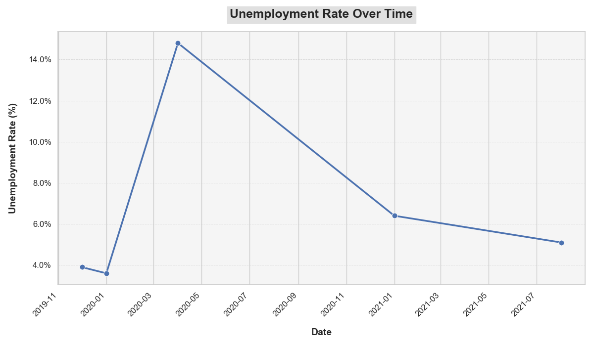

# COVID-19  Analysis

# Health Impacts 

### Overview

This repository contains a Python script that generates a bar chart visualizing the total number of COVID-19 cases reported by the top 10 countries with the highest case counts. The chart helps in understanding the global impact of the pandemic and provides a clear comparison of case counts across different countries.

### Chart

### Chart Description

#### Title:
**"Global Impact of COVID-19: Top 10 Countries with the Highest Total Case Counts"**

#### Data:
The chart represents the total number of COVID-19 cases for the following countries:

- **United States**: 111,820,082 cases
- **India**: 45,035,393 cases
- **France**: 40,138,560 cases
- **Germany**: 38,828,995 cases
- **Brazil**: 38,743,918 cases
- **South Korea**: 34,571,873 cases
- **Japan**: 33,803,572 cases
- **Italy**: 26,723,249 cases
- **United Kingdom**: 24,910,387 cases
- **Russia**: 24,124,215 cases

#### Analysis:

- **United States**: The U.S. leads significantly with around 111.8 million cases, reflecting a high impact of the pandemic.
- **India**: With approximately 45 million cases, India is the second most affected country, highlighting the severe pandemic impact in a densely populated region.
- **European Impact**: France and Germany have high case counts, emphasizing the substantial burden in Western Europe.
- **Brazil**: Brazil’s 38.7 million cases show a similar impact to Germany and France, indicating severe effects in South America.
- **Other Countries**: South Korea, Japan, Italy, the UK, and Russia each report significant case numbers, underlining the global reach of COVID-19.
--
### COVID-19 Deaths by Country

This table presents data on the number of COVID-19 deaths for the top 10 countries with the highest death tolls. The data is based on reported figures and provides a snapshot of the impact of the pandemic globally. 

| **Country**       | **Deaths** |
|-------------------|------------|
| United States     | 1,173,000  |
| Brazil            | 735,000    |
| India             | 530,000    |
| Mexico            | 340,000    |
| Russia            | 330,000    |
| Peru              | 280,000    |
| Indonesia         | 270,000    |
| Turkey            | 260,000    |
| Italy             | 240,000    |
| United Kingdom    | 230,000    |

#### Data Source

The data is sourced from publicly available COVID-19 tracking systems and health reports. This table is meant to provide an overview of the relative scale of deaths across different countries.

#### Notes

- The numbers are rounded to the nearest thousand.
- The data may be subject to change as new information becomes available and as reports are updated.

  
### Data File

The data used in this project is available as a CSV file. You can download it using the following link:

[Download CSV File](https://github.com/AlaFadeli/Covid-19-data-visualization/blob/master/country_wise_latest.csv)

### **Global Economic Impact**

1. **Global GDP**
   - **2020**: The global economy contracted by approximately 3.5% according to the International Monetary Fund (IMF).
   - **2021**: A strong rebound with a growth rate of around 6.0%, as per IMF estimates.
   - **2022 and Beyond**: Recovery has continued but at a slower pace, with challenges including inflation and supply chain disruptions.

2. **Unemployment Rates**
   - **2020**: Unemployment rates surged globally. In the U.S., the unemployment rate peaked at 14.8% in April 2020.
   - **2021**: Gradual improvement, but still elevated compared to pre-pandemic levels. For example, the U.S. unemployment rate was around 6.0% in March 2021.
   - **Current Trends**: Varies by region, with ongoing issues in some sectors and areas.

3. **Sectoral Impacts**
   - **Travel and Tourism**: Severe contraction, with global international tourist arrivals dropping by around 74% in 2020 according to the UN World Tourism Organization.
   - **Retail and Hospitality**: Significant downturn in sectors dependent on physical presence, though recovery has been mixed and varies by region.
   - **Technology and E-commerce**: Surge in demand for digital services, with e-commerce growing substantially. For instance, global e-commerce sales grew by 27.6% in 2020.

4. **Supply Chain Disruptions**
   - **Shortages and Inflation**: Disruptions led to shortages of goods and raw materials, contributing to inflationary pressures. The IMF reported rising inflation rates in many countries as a result.

5. **Debt Levels**
   - **Government Debt**: Increased substantially as governments took on more debt to fund stimulus measures. For instance, global public debt rose to about 98% of GDP in 2021 according to the IMF.
   - **Corporate Debt**: Increased in some sectors due to borrowing for survival during downturns.

6. **Business Closures and Bankruptcies**
   - **Small Businesses**: Many small and medium-sized enterprises (SMEs) faced closures or significant financial distress.
   - **Large Corporations**: Some large companies also experienced financial difficulties, leading to layoffs and restructuring.

